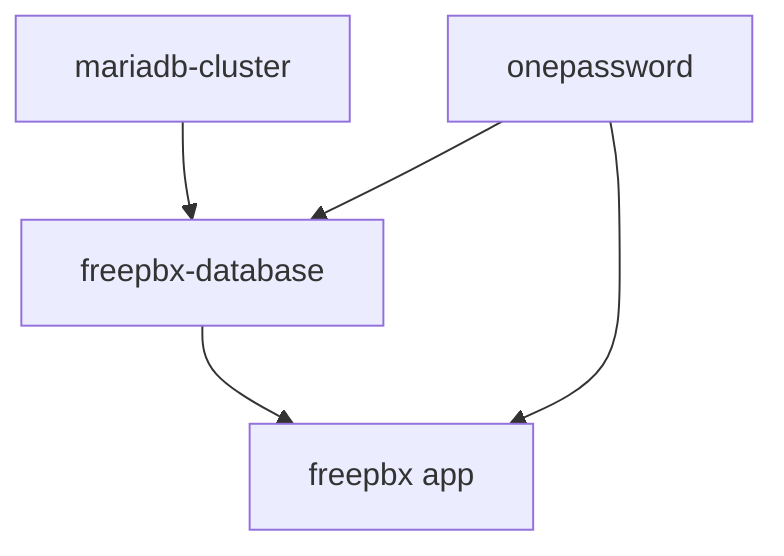

# FreePBX

[FreePBX](https://www.freepbx.org/) is a containerized telephony platform deployed in the `voip` namespace with a MariaDB database backend.

## Architecture

FreePBX runs as two complementary deployment models:

1. **Containerized instance** (`b1-k3s01`) -- Kubernetes-native deployment via Helm chart in the `voip` namespace
2. **KubeVirt VM instances** (`b1-k3s01`, `b2-k3s01`, `b3-k3s01`) -- Full Debian 12 VMs running FreePBX with Cloudflare Tunnel access

### Container Deployment

```
kubernetes/apps/voip/freepbx/
├── app/
│   ├── helmrelease.yaml       # FreePBX container deployment
│   ├── ocirepository.yaml     # OCI chart source (app-template)
│   ├── externalsecret.yaml    # 1Password DB credentials
│   └── kustomization.yaml
├── database/
│   ├── database.yaml          # MariaDB databases (b1_asterisk, b1_asteriskcdrdb)
│   ├── user.yaml              # MariaDB user (freepbx)
│   ├── grant.yaml             # Database permissions
│   ├── externalsecret.yaml    # DB password from 1Password
│   └── kustomization.yaml
└── ks.yaml                    # Flux Kustomizations
```

### Configuration

| Setting | Value |
|---------|-------|
| Image | `ghcr.io/00o-sh/fpbx-docker:latest` |
| Helm chart | `bjw-s-labs/app-template` (OCI, v4.6.2) |
| CPU request | 100m |
| Memory request | 512Mi |
| Memory limit | 2Gi |
| URL | `freepbx.00o.sh` |

### Service Ports

| Port | Protocol | Purpose |
|------|----------|---------|
| 80 | HTTP | Web interface |
| 443 | HTTPS | Secure web interface |
| 8001 | HTTP | Unified Communications Portal (UCP) |
| 8003 | HTTP | Admin interface |

### Persistence

| Mount | Size | Storage Class |
|-------|------|---------------|
| `/etc/asterisk` | 1Gi | openebs-hostpath |
| `/var/lib/asterisk` | 5Gi | openebs-hostpath |
| `/var/spool/asterisk` | 5Gi | openebs-hostpath |
| `/var/log/asterisk` | emptyDir | -- |

## Database

FreePBX uses the MariaDB Galera cluster in the `database` namespace. Database resources are managed via MariaDB Operator CRs.

### Databases

| Database | Purpose |
|----------|---------|
| `b1_asterisk` | Main Asterisk configuration |
| `b1_asteriskcdrdb` | Call Detail Records (CDR) |

Both databases use `utf8mb4` character set with `utf8mb4_unicode_ci` collation.

### Connection Details

```
Host: mariadb-primary.database.svc.cluster.local
Port: 3306
User: freepbx
Max connections: 100
```

### Managed Resources

The database setup uses MariaDB Operator custom resources:

- **Database** -- creates `b1_asterisk` and `b1_asteriskcdrdb`
- **User** -- creates the `freepbx` user with password from 1Password
- **Grant** -- grants `ALL PRIVILEGES` on both databases

All resources have `cleanupPolicy: Skip` to prevent accidental data loss on removal.

## KubeVirt VM Instances

Three FreePBX VMs run on KubeVirt for full-OS telephony deployments with Cloudflare Tunnel access.

```
kubernetes/apps/kubevirt/virtualmachines/freepbx/
├── b1-k3s01/       # Instance 1
├── b2-k3s01/       # Instance 2
└── b3-k3s01/       # Instance 3
```

### VM Specifications

| Instance | IP | MAC | CPU | RAM | Storage |
|----------|----|-----|-----|-----|---------|
| b1-k3s01 | 192.168.57.14 | 52:54:00:57:00:14 | 2 | 4Gi | 50Gi NFS |
| b2-k3s01 | 192.168.57.15 | 52:54:00:57:00:15 | 2 | 4Gi | 50Gi NFS |
| b3-k3s01 | 192.168.57.16 | 52:54:00:57:00:16 | 2 | 4Gi | 50Gi NFS |

### VM Features

- **Base image**: Debian 12 (containerdisks)
- **Network**: Macvtap with static IP (direct L2 access)
- **Live migration**: Enabled (NFS storage + evictionStrategy)
- **DNS**: `{instance}.00o.sh` via external-dns
- **Cloud-init provisioning**:
    - FreePBX installation via `sng_freepbx_debian_install.sh`
    - Cloudflare Tunnel (`cloudflared`) for secure external access
    - SSH key and user account setup
    - qemu-guest-agent for VM management

### VM Management

```sh
# Via virtctl
virtctl console freepbx-b1-k3s01
virtctl start freepbx-b1-k3s01
virtctl stop freepbx-b1-k3s01
virtctl migrate freepbx-b1-k3s01

# Via task runner
task vm:console VM=freepbx-b1-k3s01
task vm:start VM=freepbx-b1-k3s01
task vm:stop VM=freepbx-b1-k3s01
```

## Dependencies

### Container Deployment

- MariaDB Galera cluster (`mariadb-cluster` Kustomization)
- 1Password ExternalSecrets (`onepassword` Kustomization)
- Envoy Gateway (`envoy-external` in network namespace)

### VM Deployment

- KubeVirt operator and CDI
- Macvtap CNI plugin (network namespace)
- 1Password ExternalSecrets (Cloudflare Tunnel token)

## Flux Dependency Chain



The database resources are created in the `database` namespace first, then the FreePBX container deploys in the `voip` namespace once the databases are ready.
