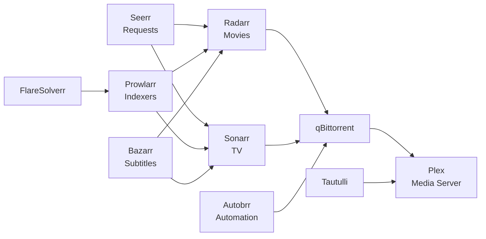

# Media Stack

The media namespace contains 13 applications for media management and consumption.

## Architecture

## Applications

### Plex

Media server for streaming movies, TV shows, music, and photos.

- Multiple component directories for complex configuration
- NFS storage for media library

### Radarr & Sonarr

Movie and TV series collection managers:

- Automate downloading and organizing media
- Integration with Prowlarr for indexer management
- Quality profiles managed by Recyclarr

### Prowlarr

Centralized indexer manager for all *arr applications:

- Uses FlareSolverr for Cloudflare-protected sites
- Syncs indexers to Radarr and Sonarr

### qBittorrent + Qui

Torrent client with a custom web UI:

- qBittorrent handles downloads
- Qui provides a modern web interface

### Autobrr

Automation for torrent trackers:

- Monitors IRC announces and RSS feeds
- Sends releases to *arr apps or directly to qBittorrent

### Seerr

Media request and discovery platform:

- Users can request movies and TV shows
- Integrates with Radarr and Sonarr for automatic fulfillment

### Bazarr

Subtitle management:

- Automatically downloads subtitles for movies and TV shows
- Integrates with Radarr and Sonarr

### Supporting Services

- **Recyclarr** -- Syncs quality profiles to *arr apps from TRaSH Guides
- **Tautulli** -- Plex monitoring and statistics
- **FlareSolverr** -- Cloudflare bypass proxy for Prowlarr
- **TheLounge** -- Self-hosted IRC client for tracker communication
