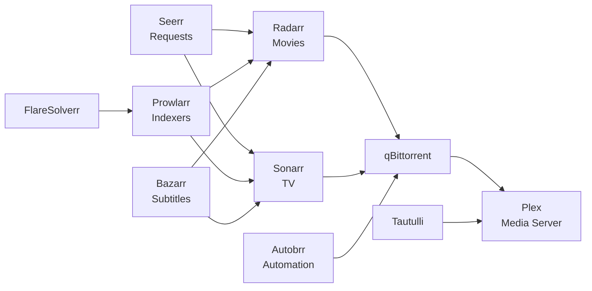

# Media Stack

The media namespace contains 13 applications for media management and consumption.

## Architecture



## Storage Pattern

All media apps follow a consistent three-tier storage strategy:

| Mount | Type | Storage Class | Access Mode | Purpose |
|-------|------|--------------|-------------|---------|
| `/config` | PVC | `openebs-hostpath` | ReadWriteOnce | App config, databases (backed up via VolSync) |
| `/media` | NFS | External NAS | ReadWriteMany | Shared media library |
| `/tmp` | emptyDir | — | — | Ephemeral scratch space |

**NFS media mount:**

- Server: `nas.3226texas.com`
- Path: `/mnt/Rust/Media`
- Container path: `/media`
- Plex mounts as **read-only**; *arr apps mount as **read-write**

### Security Context

All media apps run with a standard security profile:

```yaml
securityContext:
  runAsNonRoot: true
  runAsUser: 1000
  runAsGroup: 1000
  fsGroup: 1000
  allowPrivilegeEscalation: false
  readOnlyRootFilesystem: true
  capabilities:
    drop: ["ALL"]
```

## Applications

### Plex

Media server for streaming movies, TV shows, music, and photos.

- LoadBalancer service at `10.0.6.14`
- Exposed at `plex.00o.sh` and `plex-direct.00o.sh`
- Resources: 100m CPU, 256Mi–2Gi memory
- NFS media mounted read-only

### Radarr & Sonarr

Movie and TV series collection managers:

- Automate downloading and organizing media
- Integration with Prowlarr for indexer management
- Quality profiles managed by Recyclarr
- External authentication via Kanidm
- Resources: 100m CPU, 1Gi–4Gi memory

### Prowlarr

Centralized indexer manager for all *arr applications:

- Uses FlareSolverr for Cloudflare-protected sites
- Syncs indexers to Radarr and Sonarr

### qBittorrent + Qui

Torrent client with a custom web UI:

- qBittorrent handles downloads
- Qui provides a modern web interface

### Autobrr

Automation for torrent trackers:

- Monitors IRC announces and RSS feeds
- Sends releases to *arr apps or directly to qBittorrent

### Seerr

Media request and discovery platform:

- Users can request movies and TV shows
- Integrates with Radarr and Sonarr for automatic fulfillment

### Bazarr

Subtitle management:

- Automatically downloads subtitles for movies and TV shows
- Integrates with Radarr and Sonarr

### Supporting Services

- **Recyclarr** — Syncs quality profiles to *arr apps from TRaSH Guides
- **Tautulli** — Plex monitoring and statistics
- **FlareSolverr** — Cloudflare bypass proxy for Prowlarr
- **TheLounge** — Self-hosted IRC client for tracker communication

## NFS Dependency

Media apps that mount NFS volumes should include the NFS-scaler component to prevent crash-loops when NFS is unavailable:

```yaml
# In the app's ks.yaml
spec:
  components:
    - name: nfs-scaler
```

The NFS-scaler uses KEDA to monitor `probe_success{instance=~".+:2049"}` and scales the deployment to 0 when NFS is down.

## Adding a New Media App

1. Create directory: `kubernetes/apps/media/<app-name>/app/`
2. Follow the standard HelmRelease pattern with NFS media mount
3. Use UID/GID 1000 in security context (matches NFS permissions)
4. Add NFS-scaler component if the app mounts NFS
5. Add VolSync component for config backup
6. Add to Homepage dashboard
7. Update the namespace kustomization
