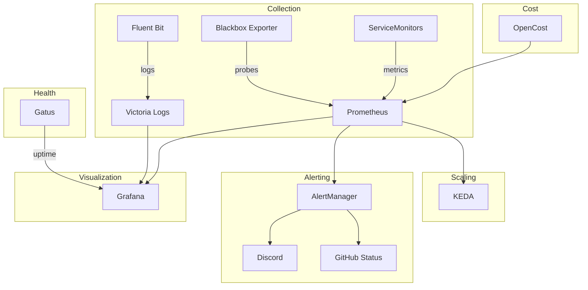

# Observability

The observability namespace provides comprehensive monitoring, logging, and alerting.

## Stack Overview

## Components

### kube-prometheus-stack

The foundation of the monitoring stack:

- **Prometheus** -- Metrics collection and storage
- **AlertManager** -- Alert routing and notification
- **Grafana** -- Dashboards and visualization
- Pre-configured with Kubernetes dashboards

### Victoria Logs

Log aggregation and search:

- Receives logs from Fluent Bit
- Grafana datasource for log querying
- Lower resource usage than Elasticsearch/Loki

### Fluent Bit

Log forwarding and collection:

- Collects logs from all pods
- Forwards to Victoria Logs
- Lightweight DaemonSet

### Gatus

Health monitoring and uptime tracking:

- Monitors service endpoints
- Provides uptime dashboards
- Configurable health checks

### OpenCost

Kubernetes cost monitoring:

- Real-time cost allocation per namespace, deployment, pod
- Kanidm SSO integration
- Prometheus metrics integration

### KEDA

Event-driven autoscaling:

- Powers the NFS-scaler component
- Powers Forgejo runner scaling
- Queries Prometheus for scaling decisions

### Supporting Tools

- **Blackbox Exporter** -- Probe endpoints for HTTP, TCP, DNS, ICMP
- **Kromgo** -- Custom metrics publishing
- **Silence Operator** -- Declarative alert silencing

## Alert Channels

| Channel | Integration | Purpose |
|---------|-------------|---------|
| Discord | Webhook | Real-time notifications |
| GitHub | Status API | PR/commit status updates |

Alert configuration is modular via `kubernetes/components/alerts/`:

- `alertmanager/` -- Routing rules
- `discord/` -- Discord webhook config
- `github-status/` -- GitHub integration
