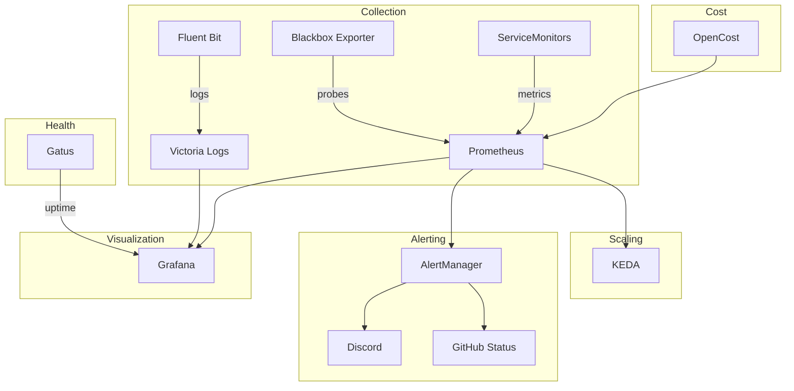

# Observability

The observability namespace provides comprehensive monitoring, logging, and alerting.

## Stack Overview



## Components

### kube-prometheus-stack

The foundation of the monitoring stack:

- **Prometheus** — Metrics collection and storage
- **AlertManager** — Alert routing and notification (at `alertmanager.00o.sh`)
- **Grafana** — Dashboards and visualization (managed by Grafana Operator)
- Pre-configured with Kubernetes dashboards

**Prometheus configuration:**

| Setting | Value |
|---------|-------|
| Retention | 14 days |
| Retention size | 50 GB |
| Storage | 50Gi on `nfs-fast` |
| Memory limit | 2000Mi |

### Grafana Dashboards

Pre-configured dashboards auto-imported from Grafana.com:

| Dashboard | Grafana ID | Purpose |
|-----------|-----------|---------|
| cilium-agent | 16611 | Cilium agent metrics |
| cilium-operator | 16612 | Cilium operator health |
| kubernetes-api-server | 15761 | API server performance |
| kubernetes-coredns | 15762 | CoreDNS metrics |
| kubernetes-global | 15757 | Cluster-wide overview |
| kubernetes-namespaces | 15758 | Per-namespace resources |
| kubernetes-nodes | 15759 | Node performance |
| kubernetes-pods | 15760 | Pod utilization |
| kubernetes-volumes | 11454 | Persistent volume metrics |
| node-exporter-full | 1860 | Full node system metrics |
| prometheus | 19105 | Prometheus self-monitoring |

### Victoria Logs

Log aggregation and search:

- Receives logs from Fluent Bit
- Grafana datasource for log querying
- Lower resource usage than Elasticsearch/Loki

### Fluent Bit

Log forwarding and collection:

- Collects logs from all pods via DaemonSet
- Forwards to Victoria Logs
- Lightweight with minimal resource overhead

### Gatus

Health monitoring and uptime tracking:

- Monitors service endpoints
- Provides uptime dashboards
- Configurable health checks

### OpenCost

Kubernetes cost monitoring:

- Real-time cost allocation per namespace, deployment, pod
- Kanidm SSO integration for dashboard access
- Prometheus metrics integration

### KEDA

Event-driven autoscaling:

- Powers the NFS-scaler component (scales on NFS availability)
- Powers Forgejo runner scaling (scales on webhook events)
- Queries Prometheus for scaling decisions

### Supporting Tools

- **Blackbox Exporter** — Probe endpoints for HTTP, TCP, DNS, ICMP
- **Kromgo** — Custom metrics publishing
- **Silence Operator** — Declarative alert silencing via CRDs

## Alert Channels

| Channel | Integration | Purpose |
|---------|-------------|---------|
| Discord | Webhook | Real-time notifications |
| GitHub | Status API | PR/commit status updates |

Alert configuration is modular via `kubernetes/components/alerts/`:

- `alertmanager/` — Routing rules
- `discord/` — Discord webhook config
- `github-status/` — GitHub integration

### Built-in Alert Rules

The kube-prometheus-stack includes three custom alert rules:

| Alert | Trigger | Severity |
|-------|---------|----------|
| **Dockerhub Rate Limiting** | >100 containers pulling from docker.io in 30s | critical |
| **OOMKilled** | Container OOMKilled >1 times in 10min | critical |
| **ZFS Pool State** | ZFS pool not in "online" state | critical |

## Useful Prometheus Queries

### Cluster Resources

```promql
# CPU usage by namespace
sum(rate(container_cpu_usage_seconds_total[5m])) by (namespace)

# Memory usage by namespace
sum(container_memory_working_set_bytes) by (namespace)

# Pod restart count (last hour)
increase(kube_pod_container_status_restarts_total[1h]) > 0
```

### Storage

```promql
# PVC usage percentage
kubelet_volume_stats_used_bytes / kubelet_volume_stats_capacity_bytes * 100

# NFS availability (used by NFS-scaler)
probe_success{instance=~".+:2049"}
```

### Networking

```promql
# Network traffic by pod
sum(rate(container_network_receive_bytes_total[5m])) by (pod)

# LoadBalancer service health
cilium_services_total
```

## Accessing Dashboards

- **Grafana**: Available via Envoy Gateway (internal)
- **AlertManager**: `alertmanager.00o.sh`
- **OpenCost**: Available via Envoy Gateway with Kanidm SSO
- **Gatus**: Available via Envoy Gateway (internal)
