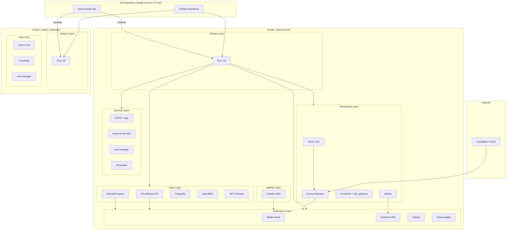
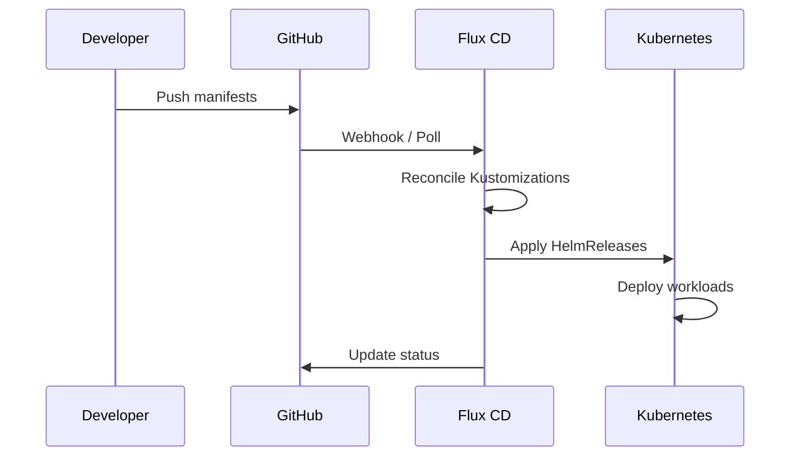
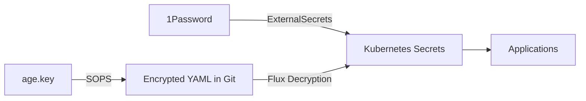

# Architecture

## High-Level Overview



## Multi-Cluster Architecture

The repository manages **multiple Kubernetes clusters** from a single Git repository using an active/standby model.

### Clusters

| Cluster | Location | Subnet | Status | Notes |
|---------|----------|--------|--------|-------|
| `3226` | Default | `10.0.6.0/24` | Active | Default cluster, all tasks default to this |
| `usny01` | US-NY-01 | `10.1.6.0/24` | Standby | Infrastructure prepped, pending bootstrap |

### How It Works

- **Shared manifests**: `kubernetes/apps/` contains all application manifests shared across clusters
- **Per-cluster entry points**: `kubernetes/flux/<cluster>/ks.yaml` defines each cluster's root Flux Kustomization
- **Per-cluster config**: `clusters/<cluster>/` holds cluster-specific configuration and credentials
- **Flux substitution**: Cluster-specific values (CIDRs, IPs, domains) are injected via `${VARIABLE}` substitution from `cluster-secrets`
- **Active/standby failover**: The `active-cluster` file at repo root controls which cluster runs workloads

### Failover Model

One cluster runs all workloads (active) while the standby keeps only infra running:

- **Infra namespaces** (never suspended): cert-manager, flux-system, kube-system, openebs-system, external-secrets
- **Workload namespaces** (follow `SUSPEND_DEFAULT`): everything else

The `SUSPEND_DEFAULT` variable in each cluster's root `ks.yaml` controls suspension. Infra apps have `cluster.home/role: infra` label and are excluded from the suspension patch.

## GitOps Flow

All cluster state is defined in Git. Changes flow through this pipeline:



## Directory Layout

```
special-winner/
├── .github/workflows/     # CI/CD pipelines
├── .taskfiles/            # Task automation (bootstrap, talos, template, vm)
├── active-cluster         # Which cluster is active (e.g. "3226")
├── clusters/              # Per-cluster configuration
│   ├── 3226/              # Cluster "3226" config, credentials, kubeconfig
│   └── usny01/            # Cluster "usny01" config, credentials, kubeconfig
├── bootstrap/             # Initial cluster bootstrap (Helmfile, SOPS secrets)
├── kubernetes/
│   ├── apps/              # Application manifests (17 namespaces, shared across clusters)
│   ├── components/        # Shared components (alerts, nfs-scaler, volsync, sops)
│   └── flux/              # Per-cluster Flux entry points
│       ├── 3226/ks.yaml   # Root Kustomization for cluster 3226
│       └── usny01/ks.yaml # Root Kustomization for cluster usny01
├── talos/                 # Talos Linux config and patches
├── templates/             # Jinja2 templates for config generation
├── scripts/               # Bootstrap and utility scripts
├── docs/                  # This documentation
├── mkdocs.yml             # Documentation site config
├── Taskfile.yaml          # Root task runner
├── .mise.toml             # Development tool versions
├── .sops.yaml             # SOPS encryption rules
└── makejinja.toml         # Template rendering config
```

## Application Structure

Every application follows a consistent pattern:

```
kubernetes/apps/<namespace>/<app-name>/
├── app/
│   ├── helmrelease.yaml       # Helm chart deployment
│   ├── ocirepository.yaml     # OCI chart source
│   ├── secret.sops.yaml       # Encrypted secrets (if needed)
│   └── kustomization.yaml     # Manifest aggregation
└── ks.yaml                    # Flux Kustomization
```

## Namespace Map

| Namespace | Purpose | Key Apps |
|-----------|---------|----------|
| `actions-runner-system` | CI/CD runners | Actions Runner Controller |
| `cert-manager` | TLS certificates | cert-manager |
| `database` | Database services | CloudNative-PG, MariaDB Galera, Dragonfly, DBGate |
| `default` | Test workloads | echo, LibreSpeed |
| `external-secrets` | Secret management | External Secrets, 1Password |
| `flux-system` | GitOps | Flux Operator, Flux Instance |
| `forgejo-runner-system` | Forgejo CI/CD | Forgejo Runner (ScaledJob) |
| `identity` | SSO/Identity | Kanidm (OAuth2 for 5+ apps) |
| `kube-system` | Core services | Cilium, CoreDNS, Spegel, kGuardian |
| `kubevirt` | Virtualization | KubeVirt, CDI, VMs |
| `media` | Media apps | Plex, *arr stack, qBittorrent |
| `network` | Network infra | Envoy Gateway, Error Pages, Cloudflare, Multus |
| `observability` | Monitoring | Prometheus, Grafana, Victoria Logs |
| `openebs-system` | Block storage | OpenEBS |
| `system-upgrade` | Upgrades | Tuppr |
| `utils` | Utilities | Forgejo, Homepage, Penpot, SMTP |
| `volsync-system` | Backups | VolSync, Garage, Kopia |

## Network Architecture

- **Cilium** provides eBPF-based CNI with advanced network policies
- **Envoy Gateway** handles HTTP routing with internal and external gateways, with custom error pages via responseOverride redirects
- **Cloudflare Tunnel** provides secure external access without port forwarding
- **Multus + Macvtap** gives VMs direct network access with dedicated MAC addresses
- **k8s_gateway** provides split-horizon DNS for internal service resolution

## Storage Architecture

| Storage Class | Backend | Use Case |
|---------------|---------|----------|
| `openebs-hostpath` | OpenEBS | Database volumes, high-performance local |
| `nfs-fast` | CSI Driver NFS | VM disks, shared media, ReadWriteMany |
| Garage S3 | Garage | Backup destination for VolSync/Kopia |

## Secret Flow



- **SOPS + Age**: Encrypts secrets in Git (`*.sops.yaml` files)
- **External Secrets Operator**: Pulls secrets from 1Password at runtime
- **Flux**: Automatically decrypts SOPS secrets during reconciliation
