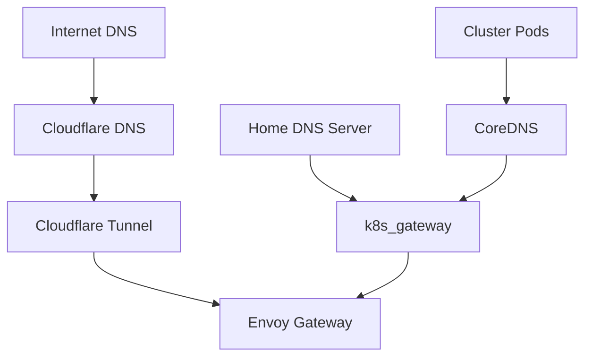

# Certificates & DNS

## cert-manager

[cert-manager](https://cert-manager.io/) automates TLS certificate management:

- Wildcard certificates via Cloudflare DNS-01 challenge
- Automatic renewal before expiry
- Certificates stored as Kubernetes Secrets

### Checking Certificates

```sh
kubectl -n network describe certificates
kubectl -n cert-manager get clusterissuers
```

## DNS Architecture



### CoreDNS

Provides in-cluster DNS resolution for pod-to-pod and pod-to-service communication.

### k8s_gateway

Provides DNS resolution for external Kubernetes resources from your home network. Your home DNS server must forward queries for your domain to the k8s_gateway address.

### External-DNS

Automatically creates DNS records in Cloudflare when services are exposed:

- Watches Kubernetes resources for DNS annotations
- Creates A/CNAME records in Cloudflare
- Used by VMs for dedicated DNS entries

### Cloudflare DNS

Manages public DNS records:

- `cloudflare-dns` -- DNS record management
- `cloudflare-tunnel` -- Secure external access without port forwarding

### UniFi DNS

Integration with UniFi network equipment for local DNS management:

- `unifi-dns` -- DNS webhook provider
- `unifi-toolkit` -- Network management toolkit
