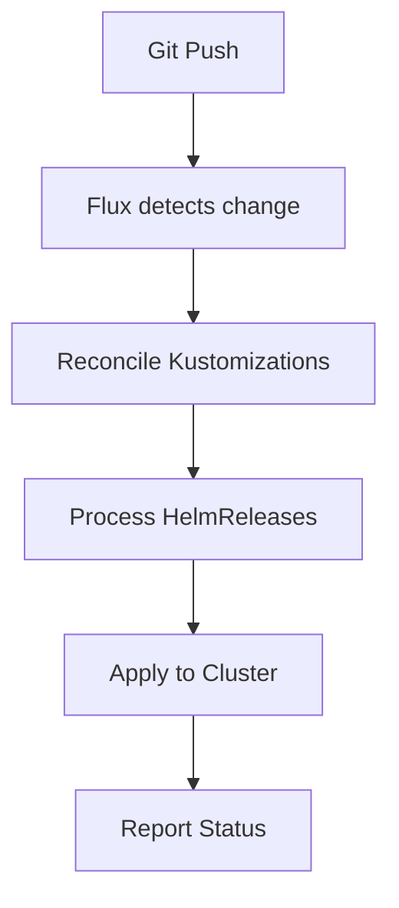

# Flux CD

[Flux CD](https://fluxcd.io/) v2.7.5 provides GitOps continuous delivery, automatically syncing the cluster state from Git.

## Architecture

The cluster uses the **Flux Operator** pattern:

- **flux-operator** (v0.41.1) -- Manages Flux components lifecycle
- **flux-instance** (v0.41.1) -- Configured Flux deployment with performance tuning

### Performance Tuning

The Flux instance is configured with:

- **10 concurrent workers** for Kustomize and Helm controllers
- **1Gi memory limits** for controllers
- **Helm caching** enabled for faster reconciliation
- **OOM detection** enabled
- **SOPS decryption** configured for Age keys

## How It Works



1. Flux watches the Git repository (via webhook or polling)
2. Kustomizations define which paths to reconcile
3. HelmReleases deploy applications from OCI registries
4. SOPS secrets are decrypted automatically
5. Post-build variable substitution injects cluster secrets

## Key Patterns

### Kustomization

```yaml
apiVersion: kustomize.toolkit.fluxcd.io/v1
kind: Kustomization
metadata:
  name: <app-name>
spec:
  interval: 1h
  path: ./kubernetes/apps/<namespace>/<app>/app
  postBuild:
    substituteFrom:
      - name: cluster-secrets
        kind: Secret
  prune: true
  sourceRef:
    kind: GitRepository
    name: flux-system
    namespace: flux-system
  targetNamespace: <namespace>
  wait: false
```

### HelmRelease

```yaml
apiVersion: helm.toolkit.fluxcd.io/v2
kind: HelmRelease
metadata:
  name: <app-name>
spec:
  chartRef:
    kind: OCIRepository
    name: <chart-name>
  interval: 1h
  values:
    # Application-specific values
```

## Common Operations

### Force Reconciliation

```sh
task reconcile
# or
flux --namespace flux-system reconcile kustomization flux-system --with-source
```

### Check Status

```sh
flux check                    # Health check
flux get sources git -A       # Git sources
flux get ks -A                # Kustomizations
flux get hr -A                # HelmReleases
```

### View Logs

```sh
flux logs --all-namespaces
```

### Suspend/Resume

```sh
flux suspend hr <name> -n <namespace>
flux resume hr <name> -n <namespace>
```

## Multi-Cluster Support

Flux manages multiple clusters from a single Git repository. Each cluster has its own root Kustomization entry point.

### Per-Cluster Entry Points

```
kubernetes/flux/
├── 3226/ks.yaml       # Root Kustomization for cluster 3226 (active)
└── usny01/ks.yaml     # Root Kustomization for cluster usny01 (standby)
```

Each `ks.yaml` defines `SUSPEND_DEFAULT` in `postBuild.substitute`, which controls whether workloads are suspended on that cluster.

### Cluster-Specific Variable Substitution

All Kustomizations reference `cluster-secrets` for variable substitution. Key variables include:

| Variable | Description |
|----------|-------------|
| `CLUSTER_NAME` | Cluster identifier (e.g. `3226`) |
| `CLUSTER_POD_CIDR` | Pod network CIDR |
| `CLUSTER_SVC_CIDR` | Service network CIDR |
| `CLUSTER_DNS_ADDR` | CoreDNS cluster IP |
| `CLUSTER_GATEWAY_ADDR` | Internal gateway LB IP |
| `SUSPEND_DEFAULT` | `"false"` (active) or `"true"` (standby) |

### Infra vs Workload Kustomizations

Infra apps are labeled with `cluster.home/role: infra` and are **never suspended**, even on standby clusters. A Flux patch injects `suspend: ${SUSPEND_DEFAULT}` into all Kustomizations that lack this label.

**Infra namespaces**: cert-manager, flux-system, kube-system, openebs-system, external-secrets

See [Cluster Failover](../operations/day2.md#cluster-failover) for failover operations.
