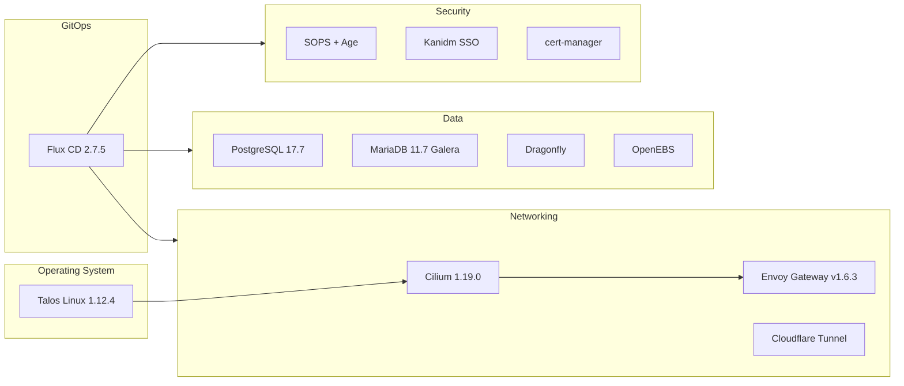

# Infrastructure

This section covers the core infrastructure components that power the cluster.

## Component Overview

## Pages

| Page | Description |
|------|-------------|
| [Talos Linux](talos.md) | Immutable Kubernetes OS configuration and management |
| [Flux CD](flux.md) | GitOps continuous delivery |
| [Cilium](cilium.md) | eBPF-based container networking |
| [Envoy Gateway](envoy-gateway.md) | HTTP routing and ingress |
| [Storage](storage.md) | OpenEBS, NFS, and backup systems |
| [Databases](databases.md) | PostgreSQL HA, MariaDB Galera, and Dragonfly |
| [Certificates & DNS](certificates-dns.md) | TLS automation and DNS management |
| [Secrets](secrets.md) | SOPS, Age, and External Secrets |
| [Identity & SSO](identity.md) | Kanidm identity provider |
