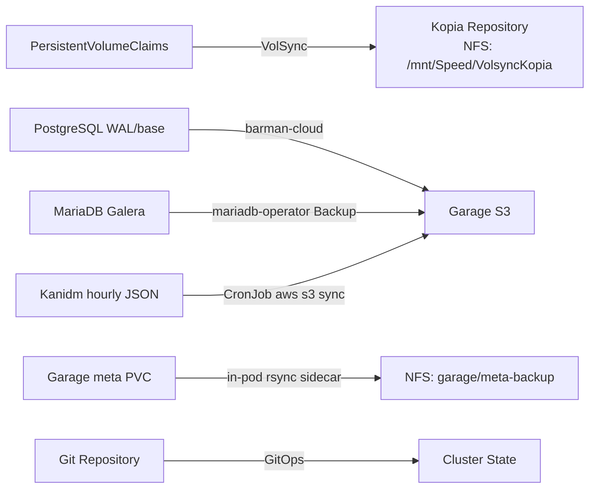

# Backup & Recovery

## Backup Architecture



The cluster uses a layered backup strategy:

| Data Type | Backup Method | Destination | Schedule |
|-----------|--------------|-------------|----------|
| Application PVCs | VolSync + Kopia | NFS Kopia repo (`/mnt/Speed/VolsyncKopia`) | Daily at 2 AM |
| PostgreSQL databases | barman-cloud (WAL + base backups) | Garage S3 (`s3://cnpg/postgres-r2/`) | Continuous WAL + scheduled |
| MariaDB databases | mariadb-operator Backup CR | Garage S3 (`s3://mariadb-backups/`) | Every 6 hours |
| Kanidm identity DB | `kanidm-backup-sync` CronJob (`aws s3 sync`) | Garage S3 (`s3://kanidm/backups/`) | Hourly |
| Garage's own LMDB meta | in-pod `backup-sync` sidecar (rsync) | NFS (`/mnt/Speed/Kubernetes/apps/garage/meta-backup/`) | Daily |
| Cluster state | Git repository | GitHub | On every push |
| Secrets | SOPS-encrypted in Git + 1Password | GitHub + 1Password | On every push |

**Note on backup destinations:** VolSync and Garage's meta backup go to **NFS**; everything else goes to **Garage S3**. Garage's own metadata is on a local PVC and can't be safely backed up via VolSync (RWO + no CSI snapshot support), so a sidecar rsync was used instead — see [Node Loss Recovery — Garage metadata recovery](node-loss-recovery.md#garage-metadata-recovery).

## VolSync

[VolSync](https://volsync.readthedocs.io/) replicates PersistentVolumeClaims to S3-compatible storage.

### Configuration Details

The VolSync component at `kubernetes/components/volsync/` provides reusable backup/restore templates:

| Setting | Value |
|---------|-------|
| **Schedule** | `0 2 * * *` (daily at 2 AM UTC) |
| **Compression** | `zstd-fastest` |
| **Copy method** | `Direct` |
| **Parallelism** | `2` threads |
| **Cache storage** | `openebs-hostpath` (5Gi) |
| **Mover user** | UID/GID 1000 |

**Retention policy:**

- 24 hourly, 7 daily, 4 weekly, 6 monthly, 2 yearly

### Applying VolSync to an Application

Reference the VolSync component in your app's `ks.yaml`:

```yaml
# In your app's ks.yaml
spec:
  components:
    - name: volsync
```

VolSync uses the `${APP}` variable (from Flux substitution) to name resources. Each app gets its own `ReplicationSource` and Kopia secret.

### Checking Backup Status

```sh
# List all backup sources and their last sync time
kubectl get replicationsource -A

# List all restore destinations
kubectl get replicationdestination -A

# Detailed status for a specific app
kubectl -n <namespace> describe replicationsource <app-name>
```

### Restoring from a VolSync Backup

!!! warning
    Restoring overwrites the existing PVC data. Ensure you understand the implications before proceeding.

1. **Scale down the application** to release the PVC:

    ```sh
    flux suspend hr <app-name> -n <namespace>
    kubectl -n <namespace> scale deploy/<app-name> --replicas=0
    ```

2. **Trigger the restore** by annotating the `ReplicationDestination`:

    ```sh
    kubectl -n <namespace> patch replicationdestination <app-name> \
      --type merge -p '{"spec":{"trigger":{"manual":"restore-once"}}}'
    ```

3. **Wait for the restore to complete**:

    ```sh
    kubectl -n <namespace> get replicationdestination <app-name> -w
    ```

4. **Resume the application**:

    ```sh
    flux resume hr <app-name> -n <namespace>
    ```

5. **Verify** the application is running with restored data:

    ```sh
    kubectl -n <namespace> get pods
    ```

### Mass Point-in-Time Restore

For disaster recovery scenarios where all VolSync-backed applications need to be restored simultaneously, use the automated mass restore script:

```sh
./scripts/volsync-restore-all.sh
```

!!! warning
    This script restores **all 16 VolSync-backed applications** at once. Ensure you understand the implications before running it.

**Supported applications (16 total):**

| Namespace | Applications |
|-----------|-------------|
| media | autobrr, bazarr, plex, prowlarr, qbittorrent, radarr, recyclarr, seerr, sonarr, tautulli, thelounge, qui |
| network | unifi-toolkit |
| observability | gatus |
| utils | forgejo, penpot |

**How it works:**

1. Suspends all Flux Kustomizations for the target apps
2. Scales down workloads (handles both Deployments and StatefulSets)
3. Patches each `ReplicationDestination` with a `restoreAsOf` timestamp and manual trigger
4. Waits for all restores to complete (20-minute timeout per app)
5. Resumes Flux Kustomizations on success

**Configuration:** Edit the `RESTORE_TIME` variable at the top of the script to set the desired point-in-time (RFC3339 format, e.g., `2026-03-01T23:59:59Z`).

**Notes:**

- Handles multi-controller apps (e.g., penpot with separate frontend/backend deployments)
- Prevents `kubectl` hangs when pods are already absent
- Reports failures at the end with a summary of which apps failed

## PostgreSQL Backups

CloudNative-PG handles PostgreSQL backups independently via the barman-cloud plugin:

- **Continuous WAL archiving** to Garage S3 (enables point-in-time recovery)
- **Scheduled base backups** with configurable retention
- **S3 bucket**: `cnpg-garage`
- Recovery cluster definition at `kubernetes/apps/database/cloudnative-pg/recovery/`

### Triggering a Manual Backup

```sh
kubectl -n database create -f - <<EOF
apiVersion: postgresql.cnpg.io/v1
kind: Backup
metadata:
  name: manual-backup-$(date +%Y%m%d%H%M)
spec:
  cluster:
    name: postgres
  method: barmanObjectStore
EOF
```

### Checking Backup Status

```sh
# List all backups
kubectl -n database get backups

# List scheduled backups
kubectl -n database get scheduledbackups

# Check backup details
kubectl -n database describe backup <backup-name>

# Check WAL archiving status
kubectl -n database get cluster postgres -o jsonpath='{.status.firstRecoverabilityPoint}'
```

## MariaDB Backups

The mariadb-operator handles MariaDB Galera backups via its `Backup` custom resource:

- **Scheduled mysqldump backups** to Garage S3 every 6 hours
- **Compression**: bzip2
- **Retention**: 30 days
- **S3 bucket**: `mariadb-backups` (prefix `galera`)
- Backup definition at `kubernetes/apps/database/mariadb-operator/cluster/backup.yaml`

### Checking Backup Status

```sh
# List all MariaDB backups
kubectl -n database get backups.k8s.mariadb.com

# Check backup details
kubectl -n database describe backup mariadb-backup
```

### Restoring from a MariaDB Backup

To restore from S3, create a new MariaDB CR with `bootstrapFrom` referencing the backup:

```yaml
apiVersion: k8s.mariadb.com/v1alpha1
kind: MariaDB
metadata:
  name: mariadb-recovery
spec:
  bootstrapFrom:
    backupRef:
      name: mariadb-backup
  # ... same spec as production cluster
```

## Disaster Recovery

### Full Cluster Recovery

Since the cluster is GitOps-managed, a full recovery follows these steps:

1. **Prepare hardware** — Boot new nodes with Talos Linux (see [Machine Preparation](../getting-started/index.md))

2. **Bootstrap the cluster**:

    ```sh
    task bootstrap:talos
    task bootstrap:apps
    ```

3. **Flux restores application state** — All manifests are pulled from Git automatically

4. **VolSync restores PVC data** — Application data is restored from Garage S3 backups

5. **PostgreSQL recovers from WAL archives** — Use the recovery cluster definition (see below)

6. **MariaDB recovers from S3 backups** — Create a recovery MariaDB CR with `bootstrapFrom` (see above)

7. **Verify all services**:

    ```sh
    flux get ks -A
    flux get hr -A
    kubectl get pods -A | grep -v Running
    ```

### PostgreSQL Point-in-Time Recovery

The recovery cluster definition at `kubernetes/apps/database/cloudnative-pg/recovery/cluster.yaml` bootstraps a new PostgreSQL cluster from S3 backups:

| Setting | Value |
|---------|-------|
| **Instances** | 2 (reduced for recovery, scale up after) |
| **PostgreSQL** | 17.7 (matches production) |
| **Source** | `postgres-backup` (Garage S3 via barman-cloud) |
| **S3 bucket** | `cnpg-garage` |

**Recovery steps:**

1. **Apply the recovery cluster** (modify target time if needed for PITR):

    ```sh
    kubectl apply -f kubernetes/apps/database/cloudnative-pg/recovery/cluster.yaml
    ```

2. **Monitor recovery progress**:

    ```sh
    kubectl -n database get cluster postgres-recovery -w
    kubectl -n database logs -l cnpg.io/cluster=postgres-recovery -f
    ```

3. **Verify data integrity** once the cluster is ready:

    ```sh
    kubectl -n database exec -it postgres-recovery-1 -- psql -U postgres -c '\l'
    ```

4. **Promote the recovery cluster** to production (update the main cluster definition to point to the recovered data, or rename the recovery cluster).

!!! tip
    For point-in-time recovery, add a `recoveryTarget` to the recovery cluster spec:
    ```yaml
    bootstrap:
      recovery:
        source: postgres-backup
        recoveryTarget:
          targetTime: "2026-02-14T12:00:00Z"
    ```

### What's Backed Up vs. Not

| Backed up | Not backed up (ephemeral) |
|-----------|--------------------------|
| Application PVCs (via VolSync) | Active VM state (VMs restart from disk images) |
| PostgreSQL databases (via WAL archiving) | In-memory caches (Dragonfly data) |
| MariaDB databases (via scheduled mysqldump) | Real-time metrics (Prometheus TSDB rebuilds) |
| Cluster manifests (in Git) | Pod logs (Victoria Logs rebuilds from Fluent Bit) |
| Secrets (SOPS in Git + 1Password) | |

## Garage S3

[Garage](https://garagehq.deuxfleurs.fr/) provides the S3-compatible storage backend:

- Self-hosted within the cluster (`kubernetes/apps/volsync-system/garage/`)
- Stores both VolSync and PostgreSQL backups
- Lightweight and resource-efficient
- Compatible with standard S3 clients and tools
