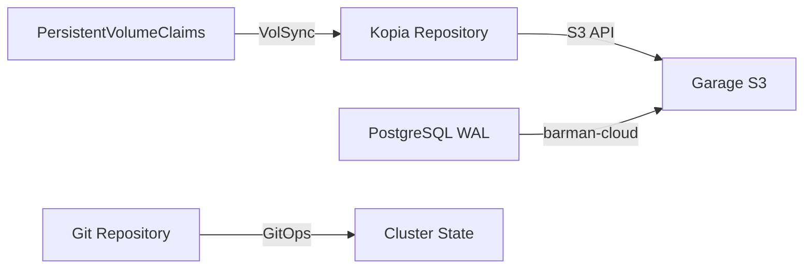

# Backup & Recovery

## Backup Architecture



## VolSync

[VolSync](https://volsync.readthedocs.io/) replicates PersistentVolumeClaims to S3-compatible storage.

### Schedule

Backups run **daily at 2 AM** by default.

### Component

The VolSync component is at `kubernetes/components/volsync/`. Apply it to stateful applications:

```yaml
# In your app's ks.yaml, reference the volsync component
spec:
  components:
    - name: volsync
```

### Checking Backup Status

```sh
kubectl get replicationsource -A
kubectl get replicationdestination -A
```

## PostgreSQL Backups

CloudNative-PG handles PostgreSQL backups independently:

- **WAL archiving** to Garage S3 via barman-cloud plugin
- **Scheduled backups** with configurable retention
- Recovery cluster definition at `kubernetes/apps/database/cloudnative-pg/recovery/`

### Triggering a Manual Backup

```sh
kubectl -n database create -f - <<EOF
apiVersion: postgresql.cnpg.io/v1
kind: Backup
metadata:
  name: manual-backup-$(date +%Y%m%d%H%M)
spec:
  cluster:
    name: postgres
  method: barmanObjectStore
EOF
```

### Checking Backup Status

```sh
kubectl -n database get backups
kubectl -n database get scheduledbackups
```

## Disaster Recovery

### Full Cluster Recovery

Since the cluster is GitOps-managed, recovery involves:

1. Bootstrap new Talos nodes
2. Run `task bootstrap:talos` and `task bootstrap:apps`
3. Flux restores all application state from Git
4. VolSync restores PVC data from Garage S3
5. PostgreSQL recovers from WAL archives

### PostgreSQL Point-in-Time Recovery

Use the recovery cluster definition:

```
kubernetes/apps/database/cloudnative-pg/recovery/cluster.yaml
```

### What's Not in Git

These items require manual restoration or are ephemeral:

- Active VM state (VMs restart from disk images)
- In-memory caches (Dragonfly data)
- Real-time metrics (Prometheus TSDB rebuilds from scrapes)

## Garage S3

[Garage](https://garagehq.deuxfleurs.fr/) provides the S3-compatible storage backend:

- Self-hosted within the cluster
- Stores VolSync and PostgreSQL backups
- Located in `kubernetes/apps/volsync-system/garage/`
